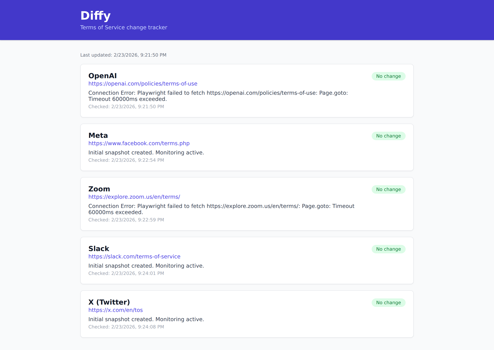

# Diffy

**Diffy** is a GitHub Pages–hosted web app that tracks changes to companies' Terms of Service pages.

## Live site

The app is deployed at: **https://bradyudovich.github.io/Diffy/**



## How it works

1. `config.json` at the repo root lists the companies and their ToS URLs to monitor.
2. A GitHub Actions workflow (future) fetches those pages, stores snapshots in `data/snapshots/`, compares them, and commits updated results to `data/results.json`.
3. The frontend (`src/App.tsx`) fetches `data/results.json` directly from the `main` branch via `raw.githubusercontent.com` on every page load (with a cache-busting timestamp query param), so it always reflects the latest committed data without needing a rebuild.
4. On every push to `main` (including when `data/results.json` changes), the Pages deployment workflow (`.github/workflows/deploy.yml`) rebuilds and redeploys the site automatically.

## Project structure

```
config.json              # List of companies and their ToS URLs — edit this to add/remove companies
data/
  results.json           # Latest diff results, committed by the update workflow
  snapshots/             # Raw ToS snapshots stored by the update workflow
terms_of_service/
  {company_slug}/        # One folder per company (slug replaces non-word chars with _)
    {YYYY-MM-DD}.txt     # Full ToS text archived each time a change is detected
    summary.txt          # Latest plain-English summary of the current ToS
src/
  App.tsx                # React frontend; fetches data/results.json from raw.githubusercontent.com
.github/workflows/
  deploy.yml             # GitHub Actions: build Vite app and deploy to GitHub Pages
  daily_scan.yml         # GitHub Actions: daily ToS scan, archiving, and summarization
```

## ToS version archiving

Each time `monitor.py` runs it archives the full ToS text under
`terms_of_service/{company_slug}/{YYYY-MM-DD}.txt`.  A new file is only
written when the fetched content differs from the most-recently archived
version, so the folder accumulates one file per distinct version (not one
file per day).  If two distinct versions are detected on the same calendar
day a numeric suffix (`_1`, `_2`, …) is appended to keep both.

Previous versions are **never deleted**, which enables historical diffs and
audit trails.

## ToS summarization

`monitor.py` uses the **content-diff method** to decide when to regenerate a
ToS summary: the raw legal text fetched from the company's ToS page is compared
byte-for-byte against the most-recently archived version.  A new summary is
generated via the OpenAI API **only** when the raw text has changed.  If the
content is identical, the previously persisted `summary.txt` is reused without
any API call.

This approach is strictly more reliable than effective-date scraping (which can
miss silent edits, trigger false positives on banner/date changes, or fail
when a company doesn't publish a revision date) because it is driven entirely
by the legal text itself.

- **No change detected** (`archive_tos_if_changed` returns `False`): the
  existing `summary.txt` is returned as-is.  The AI is **never** called on
  summary-file absence, archive-file creation, or any other event unrelated
  to content.
- **Change detected** (`archive_tos_if_changed` returns `True`): the new text
  is archived and a fresh summary is generated.
  - *First version / snapshot missing* → full overview summary via
    `call_openai_overview`.
  - *Incremental update* → diff-focused summary via `call_openai`.

Summaries are only regenerated when a new ToS version is archived — they are
**not** refreshed on every run unless the ToS content has changed.

The summary stored in `summary.txt` is read back into `data/results.json`
so the frontend always displays the latest persisted summary.  If no
summary file exists yet (e.g. the first run with no internet access), the
frontend falls back to `"Initial snapshot created. Monitoring active."`.


## Editing the company list

Open `config.json` and add or remove entries:

```json
{
  "companies": [
    { "name": "Acme Inc.", "tosUrl": "https://acme.example/terms" }
  ]
}
```

## Company logos

Each company card displays a favicon fetched from Google's favicon API:

```
https://www.google.com/s2/favicons?sz=32&domain=<company-domain>
```

If the favicon fails to load, a 🏢 fallback icon is shown instead.

## ToS summary click-through

Clicking any company card opens a modal dialog showing a privacy- and
AI-focused summary of that company's Terms of Service. The summary is
sourced from the `summary` field in `data/results.json`.

- **When changes are detected** between versions, the summary lists what
  changed in terms of privacy, data use, and AI training, with an overall
  severity rating (High, Medium, or Low).
- **When no changes are detected** (or on the first snapshot), the summary
  lists privacy risks, AI training concerns, data collection red flags, and
  other significant user rights issues found in the current ToS.

The modal displays a 📁 folder icon in the bottom-right corner that links
to the full Terms of Service page. There is no visible URL text link in
the modal or on the company card.

## Local development

```bash
npm install
npm run dev
```

The dev server runs at `http://localhost:5173/Diffy/`.

## Deployment

Pushes to `main` automatically trigger the `.github/workflows/deploy.yml` workflow, which builds the Vite app and deploys the `dist/` folder to GitHub Pages.
